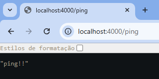

# ess-mern

Noções básicas de como desenvolver um projeto com MongoDB, Node.js/Express e React (MERN). Repositório oferecido na monitoria 
de Engenharia de Software e Sistemas (IF682), CIn-UFPE.

## Node.js Express

### Rodando o Servidor

Dentro da pasta server, execute os seguintes passos:

1. Instalando os pacotes utilizados:

```
npm install
```

2. Rodando o servidor:

```
nodemon index.js
```

O retorno desejado será algo parecido com:

```
$ nodemon index.js
[nodemon] 2.0.22
[nodemon] to restart at any time, enter `rs`
[nodemon] watching path(s): *.*
[nodemon] watching extensions: js,mjs,json
[nodemon] starting `node index.js`
Running at Port 4000
```

## React App

### Rodando o Client

Dentro da pasta client, execute os seguintes passos:

1. Instalando os pacotes utilizados:

```
npm install
```

2. Rodando o client:

```
npm start
```

O retorno desejado será algo parecido com:

```
$ npm start

> client@0.1.0 start
> react-scripts start

...

Starting the development server...

Compiled successfully!

You can now view client in the browser.

  Local:            http://localhost:3000
  On Your Network:  http://xxx.xxx.x.xxx:3000

Note that the development build is not optimized.
To create a production build, use npm run build.

webpack compiled successfully
```

## FAQ

### Como Instalar Pacotes

Para instalar pacotes, utilizamos o comando `npm install` seguido dos nomes dos pacotes desejados:

```
npm install [pacote1] [pacote2] [...]
```

Por exemplo, se vamos utilizar os dois pacotes nodemon e express, fazemos:

```
npm install nodemon express
```

Este comando irá criar um arquivo [`package.json`](https://docs.npmjs.com/cli/v10/configuring-npm/package-json) na sua pasta. Este arquivo é fundamental para qualquer projeto que utilize Node.js, armazenando informações sobre as dependências e versões utilizadas no seu projeto.  
Caso você tenha clonado um projeto de um repositório já existente (como este!), não é necessário instalar todos os pacotes individualmente (pode ser que existam centenas). Se este repositório já tiver um `package.json`, você pode simplesmente executar:
```
npm install
```

### Como Rodar um Servidor Simples

Dentro da pasta do seu servidor, crie um arquivo `index.js` e dentro dele escreva:

```js
const express = require('express');
const app = express();

app.get('/ping', (req, res) => {
    res.json('ping!')
});

app.listen(4000);
```

Este servidor está utilizando a porta 4000, e tem somente uma rota chamada GET /ping.

Uma forma de rodar o servidor Express é executando o seguinte comando:

```
node index.js
```

Caso você pretenda utilizar o pacote nodemon (recomendado), execute este comando:

```
nodemon index.js
```

Com estes passos concluídos, você pode verificar se o código está funcionando corretamente indo em qualquer navegador e acessando o endereço `localhost:4000/ping`:



## Referências

### Documentações
  
- [React](https://react.dev/reference/react)
- [React Hooks](https://react.dev/reference/react/hooks)
- [react-router](https://reactrouter.com/home)
- [Node.js](https://nodejs.org/docs/latest/api/)
- [Express Framework](https://expressjs.com/pt-br/starter/installing.html)
- [What is package.json](https://docs.npmjs.com/cli/v10/configuring-npm/package-json)
- [Mongoose](https://mongoosejs.com/docs/index.html)
- [dotenv](https://www.npmjs.com/package/dotenv)
- [cookie-parser](https://www.npmjs.com/package/cookie-parser)
- [bcryptjs](https://www.npmjs.com/package/bcryptjs)
- [jsonwebtoken](https://www.npmjs.com/package/jsonwebtoken)
- [Express Routes](https://expressjs.com/pt-br/guide/routing.html)
- [Tutorial on Routes](https://developer.mozilla.org/en-US/docs/Learn/Server-side/Express_Nodejs/routes)
- [Cross-Origin Resource Sharing (CORS)](https://expressjs.com/en/resources/middleware/cors.html)
- [Fetch API](https://developer.mozilla.org/en-US/docs/Web/API/Fetch_API)

### Outros

- [Require vs Import](https://medium.com/@chamin.njay/require-vs-import-in-node-js-abdf5427d7b0)
- [npm](https://docs.npmjs.com/downloading-and-installing-node-js-and-npm)
- [Postman](https://web.postman.co/)

